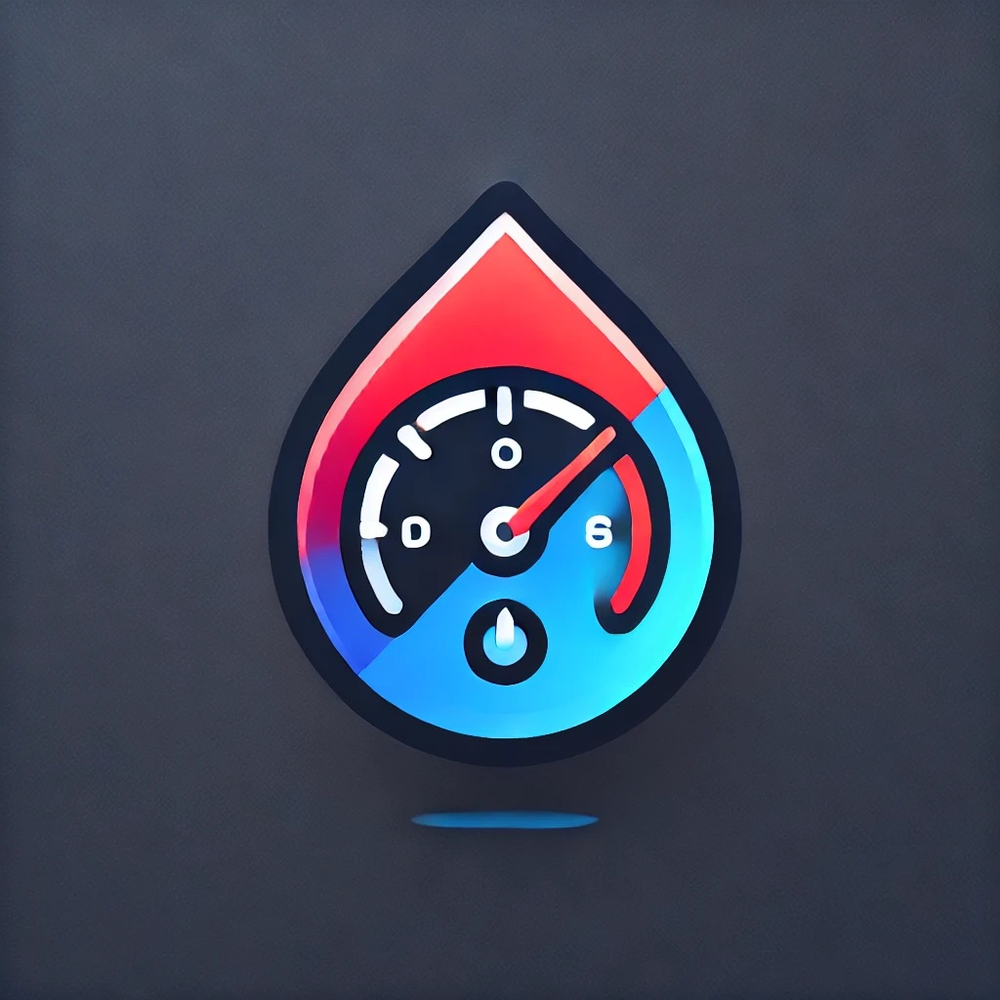

<p align="center">
  
</p>

<h1 align="center">Fuel Tune</h1>

<p align="center">
  Offline-first fuel blend calculator and fuel log for flex-fuel drivers.
</p>

<p align="center">
  
  
  
  
  
</p>

Fuel Tune is a focused utility app built for people who want to calculate ethanol/gasoline blends quickly and keep a simple local history of fuel stops without login, cloud sync, or unnecessary friction.

The product is designed around one core promise: help flex-fuel drivers make better fueling decisions with a fast, reliable, and polished experience.

## Why It Exists

- Flex-fuel drivers often need quick help deciding how much ethanol and gasoline to add.
- Most utility apps in this space feel technical, cluttered, or unfinished.
- Fuel Tune aims to be simple enough for daily use and refined enough to be recommended.

## Core Features

- Blend calculator for presets like `E50`, `E75`, `E85`, `E100`, and custom blends
- Calculation by liters or by total amount
- Fuel log saved locally on device
- Premium insights for average consumption, spending, and cost per km
- Light and dark themes with local persistence
- Portuguese and English support
- Offline-first product flow

## Product Direction

Fuel Tune is intentionally narrow and practical.

- No login
- No backend
- No cloud sync
- No bloated feature set

The goal is to create a high-trust automotive utility app that feels polished, fast, and useful every time it is opened.

## Project Structure

```text
fuel_tune/
├── lib/
│   ├── config/
│   ├── l10n/
│   ├── models/
│   ├── repositories/
│   ├── screens/
│   ├── services/
│   ├── theme/
│   ├── utils/
│   └── widgets/
├── test/
├── android/
├── ios/
└── pubspec.yaml
```

## Tech Stack

- Flutter
- Dart
- Shared Preferences for local persistence
- Cupertino-inspired design system for a more refined mobile feel

## Running Locally

```bash
cd fuel_tune
flutter pub get
flutter run
```

## Quality Checks

```bash
cd fuel_tune
flutter analyze
flutter test
```

## Current Focus

- Make the premium flow feel trustworthy and elegant
- Keep the main blend experience extremely fast
- Improve presentation quality for publishing and community sharing
- Turn the repository into something clean and easy to understand

## Repository Notes

The Flutter application lives inside the [`fuel_tune`](./fuel_tune) folder.

If you want the implementation details, widgets, services, and tests, that folder is the main codebase.
